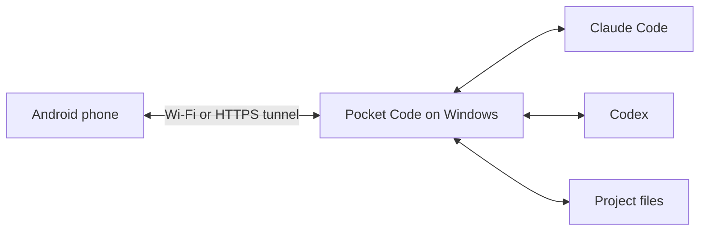

# Pocket Code

[Workspaces, boards and QR roles](docs/WORKSPACES.md) · [Рабочие области, доски и роли QR](docs/WORKSPACES.ru.md)

**Your coding workspace, within reach of your Android phone.**

Read a reply, send a follow-up, review code or pick up a task while your AI works on your Windows PC. Pocket Code connects Android to **Claude Code**, **Codex** and **GitHub Copilot** through a small PC host.

The [Windows desktop application](docs/DESKTOP.md) also shows your chats in a wider, read-only layout: select a provider and project, browse conversations, inspect Review and open AI results. It shares the Android interface components and stays in the system tray.

**GitHub Copilot:** select its workspace. Existing PC authentication (including GitHub CLI) is detected automatically. Otherwise use **Settings → Workspace → Connect GitHub Copilot** and complete GitHub sign-in in the PC browser. The host installs the official SDK and login runtime through npm; a Copilot entitlement is required. Copilot commands and file changes request approval in the chat. Copilot quota details and subagent transcripts are not yet exposed in Pocket Code.

[Download APK](https://github.com/Evgenie-Myasnikov/pocket-code/releases/latest) · [Get started](#get-started) · [Русский](docs/README.ru.md) · [Documentation](docs/README.md)

<table>
<tr><td align="center"><b>Continue a conversation</b></td><td align="center"><b>Explore your project</b></td><td align="center"><b>Make it comfortable</b></td></tr>
<tr><td></td><td></td><td></td></tr>
</table>

*Current interface screenshots with fictional sample content. No personal chats, connection keys or workplace data.*

## What can I do with it?

| When you want to… | Open… |
| --- | --- |
| Read a reply or give another instruction | **Chats** — attachments, model selection and Codex reasoning effort |
| Check what changed | **Review** inside a chat — repository, branch and code differences |
| Find an image, document or code result | **Results** inside a chat |
| Follow work or answer a question | The **right-side activity drawer** |
| Read files and project instructions | **Project** — Files, Markdown rules and Changelog |
| Work through assigned Jira issues | **Tasks** — search, filters, role-based actions and notifications |
| Change language, size, theme or permissions | **Settings** |

Switch between Claude and Codex, follow subagents when context is available, and send follow-ups while supported jobs run. Recent chats are cached on the phone and refreshed from the PC. Reading mode hides extra controls.

## How it works



The PC must stay awake and connected. Your AI account and usage limits still apply. This independent companion is not an official OpenAI, Anthropic or Atlassian app. It does not embed their desktop interfaces or include an AI subscription.

## Get started

You need **Windows 10+**, **Android 7+**, and **Claude Code and/or Codex installed and signed in on the PC**.

### 1. Run setup on your PC

Download this repository using **Code → Download ZIP**, then extract it. Double-click **Setup Pocket Code.cmd**.

Setup detects a compatible Node.js installation, including installations not yet visible in the current terminal's PATH. If needed, it downloads a private Node.js 24 LTS copy from nodejs.org and verifies its SHA-256 checksum. No winget, administrator prompt or terminal restart is required. It installs dependencies (including TypeScript) before building the Windows application and creating Desktop/Start menu shortcuts. Sign in to your provider in Settings, then pair Android by QR. Dependencies and the internet tunnel are prepared automatically.

No Android SDK is needed to use the released APK. AI sign-in stays in the native tool on your PC.

### 2. Install and scan

1. On your phone, download the APK from [the latest release](https://github.com/Evgenie-Myasnikov/pocket-code/releases/latest).
2. Install it. Allow installation from your browser or file manager if Android asks.
3. Open Pocket Code, tap **Scan QR code**, and scan the PC pairing QR.
4. Choose **Claude** or **Codex**, then open a chat or start one in your project.

**Closing or minimizing the desktop window keeps Pocket Code in the system tray.** Right-click its icon and choose **Выход (Exit)** to stop it. Windows startup is an optional checkbox. An explicitly disconnected connection stays disconnected; otherwise the application can reconnect on launch. Treat the QR like a password. A restarted temporary internet tunnel may require scanning a new QR. [Desktop application guide](docs/DESKTOP.md).

<details>
<summary>Manual setup and subsequent launches</summary>

There are only two launchers: **Setup Pocket Code.cmd** to install/update and **Start Pocket Code.cmd** to open the application. Choose internet/LAN inside the app; disconnect there or use **Exit** from the tray. Rerunning setup repairs missing build dependencies. A working Node.js 22.12+ or 24+ installation is reused; private runtime files are stored under `%LOCALAPPDATA%\Pocket Code\runtime\node`. Advanced troubleshooting scripts remain in `scripts/`.

</details>

## Before you start work

- **Permissions:** Codex defaults to Full access. Choose your access level in **Settings → AI & workspace**. Full access allows commands and file changes without approval prompts.
- **Desktop chats:** supported local histories can be opened. A chat owned by Codex Desktop may remain read-only until Desktop releases it. Cloud-only chats and every desktop artifact are not supported.
- **Jira is optional:** one shared PC connection is selected independently of the task AI. Direct MCP through Codex avoids a model turn; the existing Claude connector can consume Claude usage. Separate authorization may be required; there is no silent account fallback.
- **Task notifications:** the bell shows periodically detected changes, not Jira's complete inbox or Android push notifications.
- **Updates:** use **Settings → Updates**. Android asks for installation confirmation. Compatible hosts can apply the matching PC update when idle.
- **Saved history:** reopening is faster, but the initial connection still needs the host. This is not fully offline mode.

## Privacy and control

AI sign-in stays with the native PC tools. Android stores the pairing key through its connection vault. Recent chats are cached locally on the phone; **Disconnect and forget** clears the connection and chat cache.

Project operations run on your PC, but prompts and relevant content are processed by your AI provider. Internet mode passes encrypted traffic through Cloudflare; local HTTP is for trusted networks.

Never publish pairing QR codes, keys, credentials, private chats or the **.pocket-code** runtime folder. Documentation examples are synthetic.

## Documentation

[Start here](docs/README.md) | [Everyday workflows](docs/WORKFLOWS.md) | [Providers and accounts](docs/PROVIDERS.md) | [Troubleshooting](docs/TROUBLESHOOTING.md) | [Full user guide](docs/USER_GUIDE.md) | [Russian documentation](docs/INDEX.ru.md)

## Need help?

**[User guide](docs/USER_GUIDE.md)** · **[Руководство на русском](docs/USER_GUIDE.ru.md)** — QR pairing, diffs, updates, chats, project files and Jira tasks with screenshots.

| Problem | Try this |
| --- | --- |
| PC unavailable | Check power and host window; scan a fresh QR after a tunnel restart. |
| Host already running | Reopening the launcher reuses the existing instance. |
| AI authentication expired | Sign in again with the AI tool on the PC. |
| Codex chat busy | Finish its desktop task, close Codex Desktop if necessary, then retry. |
| Old APK says Invalid update source | Install the latest APK manually over the existing app once. |

[Report an issue](https://github.com/Evgenie-Myasnikov/pocket-code/issues) with app/host versions and reproduction steps. Remove private content from logs and screenshots.

## For contributors

[Technical reference](docs/REFERENCE.md) · [Performance audit](docs/PERFORMANCE.md) · [Feature coverage](FEATURES.md) · [Usability notes](USABILITY.md) · [Changelog](CHANGELOG.md)

```sh
npm ci
npm test
npm run build
npm run test:ui
```

Under active development. APKs are distributed through GitHub, not Google Play. Some native behaviors still require physical-device testing; see the reference for compatibility and build requirements.

### Product roadmap

The [Pocket Code board](project-boards/README.md) tracks delivered features and explicit follow-up work from CHANGELOG.md. Import its JSON into Pocket Code or open the generated board from this repository. Only product content is tracked; member identities and private conversations are excluded.

## Miro boards

Open **Settings → Miro**, choose a project, paste its `https://miro.com/app/board/...` link and connect. Open the project in **Board** to use Miro Live Embed with Miro's own interface. A repository does not need a local board file to use Miro. WorkSpace management is no longer exposed in navigation; existing host records are preserved.

Links are stored in the host's private board database, not in Git. Invitation/query parameters are discarded. Miro retains the content, accounts and access permissions. Disconnecting removes only the Pocket Code link and never deletes the board in Miro. An existing repository board file is preserved and becomes visible again after disconnecting Miro.

Miro requires an internet connection and its own sign-in. If authentication, third-party cookies or the embedded browser prevent access, use **Open in browser**. Android devices without a modern isolated WebView bridge use that browser fallback. Pocket Code cannot grant Miro permissions. This integration does not import notes into Git, synchronize task dependencies, or give the AI API access to board content.

Implementation follows [Miro Live Embed](https://developers.miro.com/docs/miro-live-embed-with-a-direct-link) and [Miro authentication](https://developers.miro.com/docs/miro-live-embed-authentication). Browser scenarios use synthetic boards; authenticated private-board editing and physical Android gestures still require device validation.
