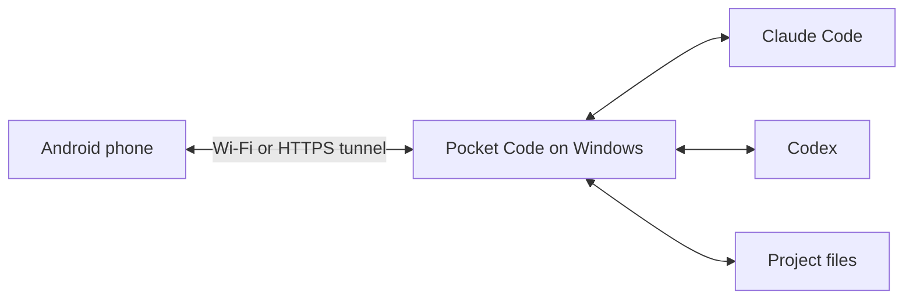

# Pocket Code

**Your coding workspace, within reach of your Android phone.**

Read a reply, send a follow-up, review code or pick up a task while your AI works on your Windows PC. Pocket Code connects Android to **Claude Code**, **Codex** and **GitHub Copilot** through a small PC host.

**GitHub Copilot:** select its workspace. Existing PC authentication (including GitHub CLI) is detected automatically. Otherwise use **Settings → Workspace → Connect GitHub Copilot** and complete GitHub sign-in in the PC browser. The host installs the official SDK and login runtime through npm; a Copilot entitlement is required. Copilot commands and file changes request approval in the chat. Copilot quota details and subagent transcripts are not yet exposed in Pocket Code.

[Download APK](https://github.com/Evgenie-Myasnikov/pocket-code/releases/latest) · [Get started](#get-started) · [Русский](docs/README.ru.md) · [Detailed guide](docs/REFERENCE.md)

<table>
<tr><td align="center"><b>Continue a conversation</b></td><td align="center"><b>Explore your project</b></td><td align="center"><b>Make it comfortable</b></td></tr>
<tr><td></td><td></td><td></td></tr>
</table>

*Current interface screenshots with fictional sample content. No personal chats, connection keys or workplace data.*

## What can I do with it?

| When you want to… | Open… |
| --- | --- |
| Read a reply or give another instruction | **Chats** — attachments, model selection and Codex reasoning effort |
| Check what changed | **Review** inside a chat — repository, branch and code differences |
| Find an image, document or code result | **Results** inside a chat |
| Follow work or answer a question | The **right-side activity drawer** |
| Read files and project instructions | **Project** — Files, Markdown rules and Changelog |
| Work through assigned Jira issues | **Tasks** — search, filters, role-based actions and notifications |
| Change language, size, theme or permissions | **Settings** |

Switch between Claude and Codex, follow subagents when context is available, and send follow-ups while supported jobs run. Recent chats are cached on the phone and refreshed from the PC. Reading mode hides extra controls.

## How it works



The PC must stay awake and connected. Your AI account and usage limits still apply. This independent companion is not an official OpenAI, Anthropic or Atlassian app. It does not embed their desktop interfaces or include an AI subscription.

## Get started

You need **Windows 10+**, **Android 7+**, and **Claude Code and/or Codex installed and signed in on the PC**.

### 1. Run setup on your PC

Download this repository using **Code → Download ZIP**, then extract it. Double-click **Setup Pocket Code.cmd**.

Setup checks Node.js 22+, offers installation through Windows Package Manager if needed, opens the Android download page, and asks whether you want Wi-Fi or internet access. The launcher asks for a project folder, installs dependencies, builds the interface and opens a pairing QR. Internet mode also installs the tunnel client automatically.

No Android SDK is needed to use the released APK. AI sign-in stays in the native tool on your PC.

### 2. Install and scan

1. On your phone, download the APK from [the latest release](https://github.com/Evgenie-Myasnikov/pocket-code/releases/latest).
2. Install it. Allow installation from your browser or file manager if Android asks.
3. Open Pocket Code, tap **Scan QR code**, and scan the PC pairing QR.
4. Choose **Claude** or **Codex**, then open a chat or start one in your project.

**Keep the host window running.** Closing only the QR browser tab does not stop it. Treat the QR like a password. Restarting a temporary internet tunnel changes its address: scan the new QR.

<details>
<summary>Manual setup and subsequent launches</summary>

Install Node.js 22+ yourself if Windows Package Manager is unavailable. Use **Start Pocket Code.cmd** for the same trusted Wi-Fi, or **Start Pocket Code Internet.cmd** for mobile data or another network. Both prepare dependencies on first use. **Stop Pocket Code.cmd** stops the host gracefully when work is idle.

</details>

## Before you start work

- **Permissions:** Codex defaults to Full access. Choose your access level in **Settings → AI & workspace**. Full access allows commands and file changes without approval prompts.
- **Desktop chats:** supported local histories can be opened. A chat owned by Codex Desktop may remain read-only until Desktop releases it. Cloud-only chats and every desktop artifact are not supported.
- **Jira is optional:** it uses the selected workspace's Atlassian MCP connection. Codex calls supported Jira tools directly without a model turn; Claude uses its existing connector through the native CLI and can consume Claude usage. A website login alone is insufficient. No silent fallback between accounts/providers occurs.
- **Task notifications:** the bell shows periodically detected changes, not Jira's complete inbox or Android push notifications.
- **Updates:** use **Settings → Updates**. Android asks for installation confirmation. Compatible hosts can apply the matching PC update when idle.
- **Saved history:** reopening is faster, but the initial connection still needs the host. This is not fully offline mode.

## Privacy and control

AI sign-in stays with the native PC tools. Android stores the pairing key through its connection vault. Recent chats are cached locally on the phone; **Disconnect and forget** clears the connection and chat cache.

Project operations run on your PC, but prompts and relevant content are processed by your AI provider. Internet mode passes encrypted traffic through Cloudflare; local HTTP is for trusted networks.

Never publish pairing QR codes, keys, credentials, private chats or the **.pocket-code** runtime folder. Documentation examples are synthetic.

## Need help?

**[User guide](docs/USER_GUIDE.md)** · **[Руководство на русском](docs/USER_GUIDE.ru.md)** — QR pairing, diffs, updates, chats, project files and Jira tasks with screenshots.

| Problem | Try this |
| --- | --- |
| PC unavailable | Check power and host window; scan a fresh QR after a tunnel restart. |
| Host already running | Reopening the launcher reuses the existing instance. |
| AI authentication expired | Sign in again with the AI tool on the PC. |
| Codex chat busy | Finish its desktop task, close Codex Desktop if necessary, then retry. |
| Old APK says Invalid update source | Install the latest APK manually over the existing app once. |

[Report an issue](https://github.com/Evgenie-Myasnikov/pocket-code/issues) with app/host versions and reproduction steps. Remove private content from logs and screenshots.

## For contributors

[Technical reference](docs/REFERENCE.md) · [Performance audit](docs/PERFORMANCE.md) · [Feature coverage](FEATURES.md) · [Usability notes](USABILITY.md) · [Changelog](CHANGELOG.md)

```sh
npm ci
npm test
npm run build
npm run test:ui
```

Under active development. APKs are distributed through GitHub, not Google Play. Some native behaviors still require physical-device testing; see the reference for compatibility and build requirements.
