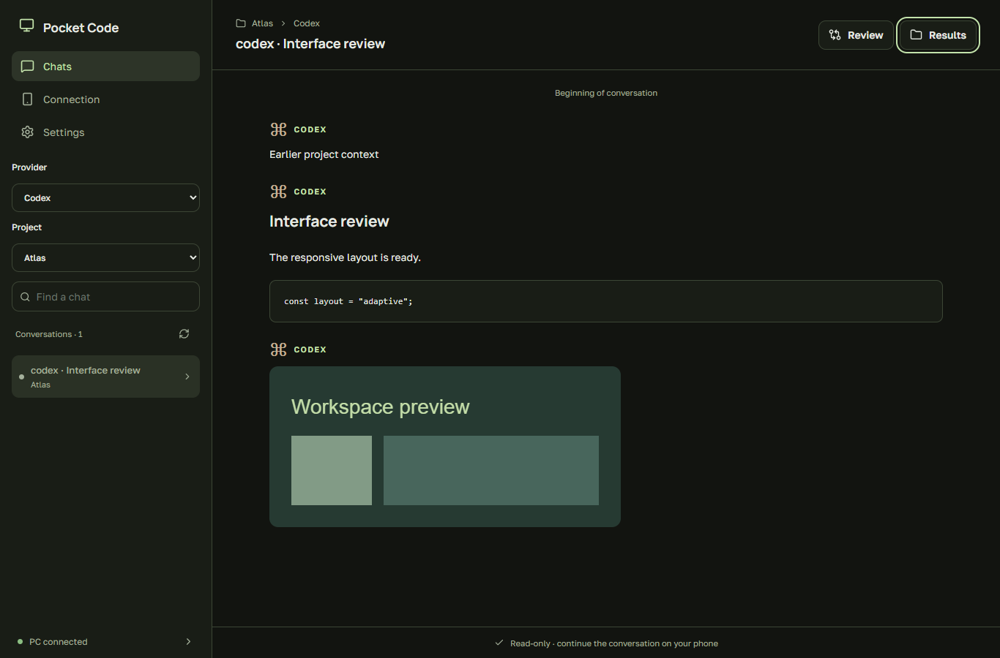

# Windows desktop application

## Automatic updates

From version **0.21.0**, **Settings → Application updates** checks GitHub after connecting and every six hours. You can disable automatic updates or check manually. The Windows application and its PC host update together. Downloads use the public release directly; GitHub CLI login is not required.

The updater verifies the release version, archive size, SHA-256 and file paths, prepares dependencies in a separate version folder, and waits for active tasks to finish. It then restarts the app and checks the host. If startup fails, it restores the previous version. Accounts, chat history, pairing key and preferences stay in the existing private data folder. A temporary internet tunnel can receive a new address after restart and require scanning the new QR.

Older Windows builds need one manual installation: update the source and run **Setup Pocket Code.cmd**, then exit the old tray app when its tasks finish and start Pocket Code again. Subsequent releases install automatically. The Windows ZIP is also available in releases; extract it and run **Pocket Code.exe** (existing WebView2 Runtime required).

See [Provider sign-in and status](PROVIDER-SIGN-IN.md) for manual login, device codes, local secret entry and server diagnostics.

[Home](../README.md) · [Русский](#russian)

Run **Setup Pocket Code.cmd** from the extracted source package to install or update. Setup automatically detects Node.js, downloads a checksum-verified private Node.js 24 LTS copy if needed, and installs npm dependencies before building. It does not require winget, administrator rights or restarting PowerShell after an existing Node installation. It adds **Pocket Code** shortcuts to Desktop and Start menu. Keep the source folder: the application uses its host scripts and dependencies. Moving that folder requires running setup again. **Start Pocket Code.cmd** opens the app and installs it if missing; internet mode and Exit are inside the app instead of separate batch files.

The desktop window uses the same TypeScript/React message renderer, Review, results gallery, image viewer, subagent viewer, themes and sizing controls as Android. Its wider layout has a left sidebar with provider, project and conversation selection. Chats are **read-only**: send messages and answer agent questions from your phone. The view refreshes automatically while open. Review uses the selected conversation's project folder; results scan that conversation's available history.

**Connection** contains pairing QR codes, internet/LAN selection and Jira setup. **Settings** contains Windows startup/reconnection, English/Russian language selection and the shared appearance controls. Preferences are local to each device; changing your PC theme does not change the phone theme.

Installation downloads a checksum-pinned Microsoft WebView2 SDK to build the Windows shell. If the WebView2 Runtime is missing, it installs Microsoft's signed bootstrapper. The window requires 64-bit Windows and uses a private local web origin. Its native bridge allows only approved read endpoints; chat requests cannot send commands or edit files. Provider credentials remain in host storage. The native layer owns the tray, startup, host lifecycle and QR pairing; it does not reimplement the chat widgets.

| Action | Result |
| --- | --- |
| Close or minimize the window | Hide in the system tray; keep the host running |
| Double-click the tray icon / Open | Restore the window |
| Disconnect | Stop an idle host and save disconnected state |
| Right-click tray icon → Exit | Exit the desktop app and terminate its owned process tree |
| Launch again | Restore the last active connection when automatic reconnection is enabled |

Enable **Запускать с Windows** to start in the tray after Windows sign-in. Clear it to remove autostart. **Восстанавливать последнее подключение** controls reconnecting on launch and after an owned host exits unexpectedly. Explicit Disconnect prevents reconnection, including after Windows restarts. Exit ends the application for now, but preserves the connection preference for its next launch.

The application recognizes an existing authenticated Pocket Code host and does not start a duplicate. A host started by the legacy console launcher remains owned by that launcher; stop it while idle before switching fully to the desktop application. Disconnect can be refused while tasks or a host update are active. Explicit Exit terminates the desktop application's own running tasks, so finish work before exiting.

The PC must stay awake. A temporary internet tunnel can receive a different URL after restart; the phone then needs the new QR. This does not provide a permanent address or remote wake-up. Connection keys stay in the existing private host storage; the desktop settings file stores preferences, not a second copy of the key.

The existing host updater updates the server. It does not replace the desktop executable: after downloading updated sources, exit the tray app and rerun **Setup Pocket Code.cmd**. To remove the desktop app, disable Windows startup, exit it, then remove its shortcuts and installed application folder. This leaves host data intact.

## Приложение для Windows

На ПК используются те же компоненты TypeScript/React, что на Android: сообщения, Review, результаты, просмотр изображений с масштабированием, субагенты, темы и размеры. Слева выбираются провайдер, проект и чат. **Чаты доступны только для чтения**; сообщения и ответы на вопросы агента отправляются с телефона. Открытая переписка обновляется автоматически.

QR-код и Jira находятся в **Подключении**, язык, оформление, автозапуск и восстановление связи — в **Настройках**. Настройки оформления сохраняются отдельно на каждом устройстве. Нужна 64-битная Windows; WebView2 при необходимости устанавливается автоматически.

Для установки или обновления запустите **Setup Pocket Code.cmd**. Node.js определяется автоматически даже в старом окне PowerShell; если подходящей версии нет, загрузится проверенная локальная копия Node.js 24 LTS. Права администратора и winget не нужны. Зависимости, включая TypeScript, устанавливаются до сборки. Для запуска остаётся **Start Pocket Code.cmd** или ярлык **Pocket Code**. Интернет-режим и выход доступны в приложении. Папку исходников оставьте на месте; после её переноса повторите установку.

- **Крестик и сворачивание** скрывают окно в трей, сервер продолжает работать.
- **Двойной щелчок по значку** возвращает окно с QR-кодом и настройкой Jira.
- **Отключить** завершает соединение и запоминает отключённое состояние. При активных задачах сначала нужно дождаться их завершения.
- **Правая кнопка по значку → Выход** завершает приложение и запущенные им процессы. Активная работа при этом прерывается.
- **Запускать с Windows** включает запуск в трее после входа в Windows.
- **Восстанавливать последнее подключение** повторяет подключение при запуске и после сбоя сервера. Явно отключённое соединение само не включится.

Интернет включается отдельной галочкой до подключения. Для домашней сети снимите её. После перезапуска временного интернет-туннеля адрес может поменяться — тогда отсканируйте новый QR на телефоне. ПК должен оставаться включённым и не спать.

Если сервер уже запущен старым консольным способом, приложение покажет его без создания второго процесса. Для полного перехода завершите старый сервер, когда нет активных задач, и запустите соединение из нового окна.

Обновления сервера продолжают работать отдельно. Для обновления самого окна Windows закройте приложение через трей, получите новые исходники и повторите **Setup Pocket Code.cmd**. APK для этой desktop-функции переустанавливать не нужно.
