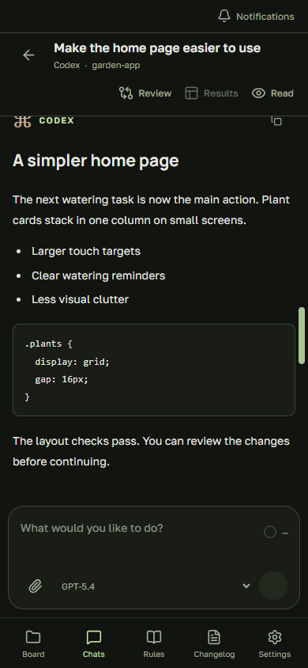
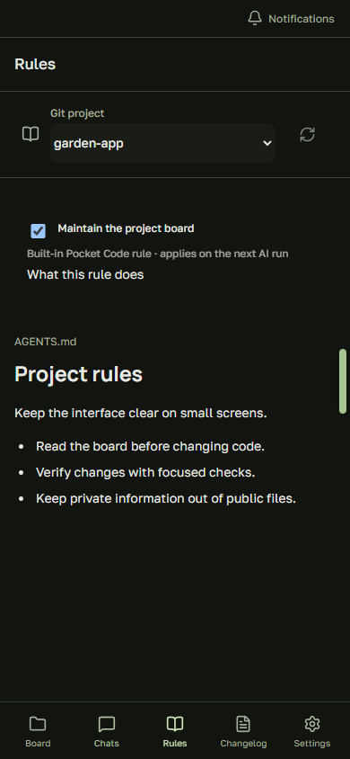
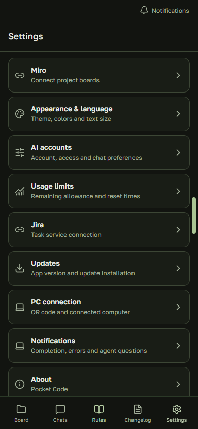

# Pocket Code

[Подробное руководство](USER_GUIDE.ru.md): QR-подключение, просмотр дифов, обновления приложения и ПК, чаты, проект и задачи.

**Рабочее окружение Claude Code, Codex и GitHub Copilot — на вашем Android-телефоне.**

**GitHub Copilot:** выберите его рабочее пространство. Вход на ПК, в том числе через GitHub CLI, определяется автоматически. Если его нет, откройте **Настройки → Рабочее пространство → Подключить GitHub Copilot** и завершите вход в браузере ПК. Официальные SDK и программа входа устанавливаются сервером через npm. Нужен доступ к Copilot; разрешения на команды и правки запрашиваются в чате. Подробные лимиты и контексты субагентов Copilot пока недоступны.

Читайте ответы, уточняйте задачу, проверяйте изменения кода и работайте с Jira, пока AI выполняет работу на вашем Windows-ПК.

[Скачать APK](https://github.com/Evgenie-Myasnikov/pocket-code/releases/latest) · [English](../README.md) · [Подробное руководство, EN](REFERENCE.md)

<table>
<tr><td></td><td></td><td></td></tr>
</table>

*Скриншоты настоящего интерфейса с вымышленным содержимым. Приложение поддерживает русский и английский. Личных переписок, рабочих задач и ключей на изображениях нет.*

## Для чего это

- **Чаты:** продолжайте разговоры с Claude/Codex, отправляйте файлы и картинки, выбирайте модель и effort Codex.
- **Ревью:** смотрите изменения файлов и ветку репозитория выбранного чата.
- **Результаты:** находите изображения, документы и код из разговора.
- **Активности справа:** следите за работой и вопросами, требующими ответа.
- **Проект:** открывайте файлы, Markdown-правила и историю изменений.
- **Задачи:** ищите и фильтруйте назначенные задачи Jira, запускайте работу и проверяйте уведомления.
- **Настройки:** язык, палитра, размер текста, масштаб, права AI и обновления.

## Подключение за несколько шагов

Нужны Windows 10+, Android 7+ и установленный Claude Code или Codex с выполненным входом на ПК.

1. На главной странице репозитория нажмите **Code → Download ZIP** и распакуйте архив.
2. Запустите **Setup Pocket Code.cmd**. Мастер проверит Node.js, при необходимости предложит установку через winget и откроет страницу загрузки APK.
3. Выберите интернет или домашний Wi-Fi, укажите папку проекта. Зависимости, сборка интерфейса и интернет-туннель подготовятся автоматически. На ПК откроется QR-код.
4. Установите APK на телефон со [страницы последнего релиза](https://github.com/Evgenie-Myasnikov/pocket-code/releases/latest). Android может попросить разрешить установку из браузера.
5. В Pocket Code нажмите **Сканировать QR-код**, затем выберите Claude или Codex и откройте чат.

Вход в AI-аккаунт и подтверждение установки APK выполняете вы. Android SDK для использования готового приложения не нужен. Если winget недоступен, установите Node.js 22+ вручную и повторите запуск.

При следующих запусках используйте **Start Pocket Code Internet.cmd** для мобильного интернета либо **Start Pocket Code.cmd** для одной доверенной Wi-Fi сети.

## Что важно знать

**ПК должен оставаться включённым, а окно сервера — открытым.** Закрытие вкладки с QR не выключает сервер. Для завершения после окончания задач есть **Stop Pocket Code.cmd**.

Временный интернет-туннель меняет адрес после перезапуска: отсканируйте новый QR. Сам QR содержит данные подключения — не публикуйте его.

Codex по умолчанию использует **полный доступ**. В настройках AI выберите подходящий режим до запуска работы: полный доступ позволяет выполнять команды и менять файлы без запросов подтверждения.

Последние сообщения сохраняются на телефоне и обновляются с ПК. Первоначальное подключение всё ещё требует доступного сервера. Чат, занятый Codex Desktop, может быть доступен только для чтения до освобождения на ПК.

## Jira и обновления

Jira необязательна и использует коннектор выбранного рабочего пространства. Codex вызывает доступные инструменты Jira напрямую, без обращения к модели; Claude использует свой существующий коннектор через CLI и может расходовать лимит Claude. Обычного входа на сайт Jira недостаточно. Автоматического переключения на другой провайдер нет. Права организации продолжают действовать. Колокольчик показывает обнаруженные изменения задач, а не полный ящик уведомлений Jira и не push на Android.

В **Настройки → Обновления** можно проверить новую версию. Android попросит подтвердить установку; совместимый сервер затем может обновиться автоматически, когда текущая работа завершится.

## Личные данные

Вход в AI остаётся в инструментах на ПК. На телефоне хранятся ключ подключения и кэш последних чатов. **Отключить и забыть** очищает подключение и кэш.

Команды выполняются на ПК, но запросы и необходимый контекст обрабатывает выбранный AI-провайдер. Интернет-режим передаёт зашифрованный трафик через Cloudflare. Локальный HTTP предназначен для доверенной сети.

Не публикуйте ключи, QR, переписки, рабочие файлы и папку `.pocket-code`. Pocket Code — независимый проект, не официальное приложение OpenAI, Anthropic или Atlassian; подписка на AI в него не входит.

## Если что-то не работает

| Проблема | Что проверить |
| --- | --- |
| ПК недоступен | Он включён, сервер работает, после перезапуска туннеля отсканирован новый QR. |
| Истекла авторизация AI | Выполните вход заново в соответствующем инструменте на ПК. |
| Чат Codex занят | Завершите работу на ПК; при необходимости закройте Codex Desktop и повторите. |
| Invalid update source в старой версии | Один раз установите свежий APK вручную поверх приложения. |

[Сообщить о проблеме](https://github.com/Evgenie-Myasnikov/pocket-code/issues): укажите версии и шаги воспроизведения, убрав личные данные из скриншотов и логов.
