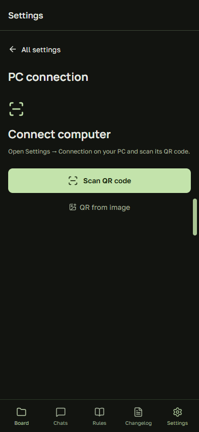
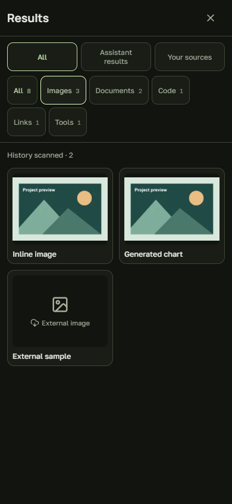
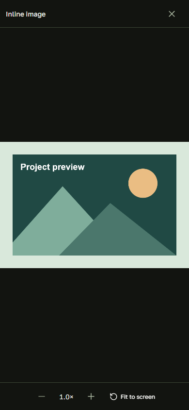
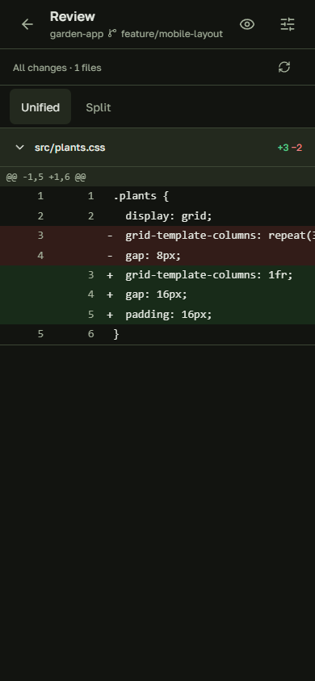
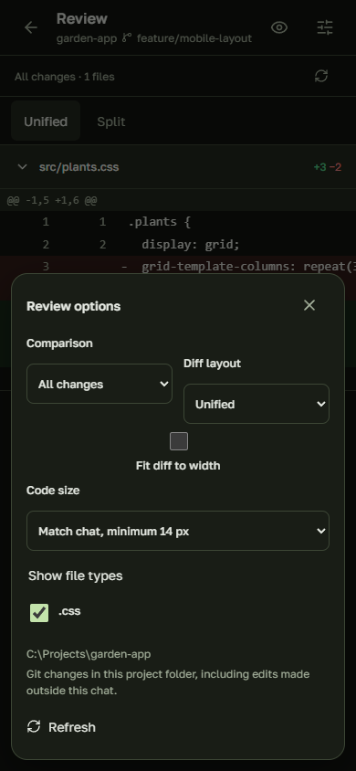
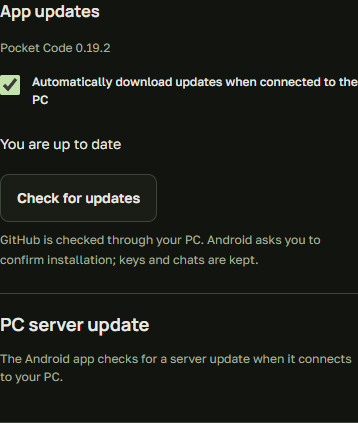

# Руководство пользователя Pocket Code

[Документация](INDEX.ru.md) · [Сценарии](WORKFLOWS.ru.md) · [Решение проблем](TROUBLESHOOTING.ru.md)

[На главную](README.ru.md) · [English](USER_GUIDE.md) · [Техническая справка](REFERENCE.md)

Выберите нужный сценарий: [QR и подключение](#qr) · [Дифы](#diff) · [Обновления](#updates) · [Чаты](#chats) · [Проект](#project) · [Jira](#tasks) · [Настройки и выход](#settings).

Все изображения ниже сделаны в настоящем интерфейсе с вымышленными данными. Скриншоты на английском; русский язык включается в настройках.

## Подключить телефон по QR

### Первый запуск

1. На ПК распакуйте исходники и запустите **Setup Pocket Code.cmd**. Проверьте, что Claude Code или Codex уже установлен и в него выполнен вход.
2. Выберите **Internet / mobile data** для другой сети или мобильного интернета; **Same trusted Wi-Fi** — когда телефон и ПК находятся в одной доверенной сети.
3. Дождитесь подготовки сервера и страницы с QR в браузере ПК. Вводить папку и нажимать Enter больше не нужно.
4. На телефоне установите APK из [последнего релиза](https://github.com/Evgenie-Myasnikov/pocket-code/releases/latest), откройте приложение и нажмите **Сканировать QR-код**.
5. Разрешите использование камеры, если Android попросит. Наведите её на QR на мониторе. После распознавания приложение само заполняет данные и пытается подключиться.

QR автоматически передаёт адрес и ключ подключения; полей ручного ввода нет. Если сохранённое или отсканированное подключение не удалось, нажмите **Повторить подключение**. При изменении адреса ПК отсканируйте новый QR.

### Если камера недоступна

Нажмите **QR из изображения** и выберите сохранённую картинку с кодом. После распознавания подключение тоже начинается автоматически. Изображение содержит ключ: не отправляйте его в публичный чат, issue или репозиторий.

### Если подключиться не удалось

| Ситуация | Что сделать |
| --- | --- |
| Телефон в мобильной сети, а QR содержит локальный адрес | Запустите интернет-режим и отсканируйте его QR. Локальный адрес ПК обычно недоступен из другой сети. |
| Перезапущен временный интернет-туннель | Отсканируйте новый QR: его адрес изменился. |
| ПК уснул или окно сервера закрыто | Разбудите ПК и запустите сервер. |
| Камера не распознаёт код | Покажите код целиком, увеличьте яркость монитора или используйте изображение QR. |
| Старый QR больше не работает | Откройте текущую страницу подключения на ПК и отсканируйте новый QR. |

Окно нового Windows-приложения закрывается **в трей**, сервер продолжает работать. Для завершения используйте **правую кнопку по значку → Выход**. У старого консольного запуска закрытие окна завершает сервер и дочерние процессы. ПК должен оставаться включённым и подключённым к сети. [Трей и автозапуск](DESKTOP.md#russian).

## Изображения из переписки

<table><tr><td></td><td></td></tr></table>

Откройте **Результаты → Изображения**: приложение постепенно ищет файлы по всей доступной истории чата. Сначала показаны все материалы; **Результаты AI** и **Ваши материалы** позволяют разделить результаты и вложения. Счётчик показывает ход поиска. Нажмите на миниатюру, увеличивайте двумя пальцами или кнопками **+ / −** и перемещайте картинку. **По экрану** возвращает исходный масштаб. Закрытие или кнопка «Назад» возвращает к прежнему месту в галерее.

У внешних изображений есть кнопка **Загрузить внешнее изображение**. Локальные картинки загружаются с подключённого ПК; удалённый файл больше нельзя просмотреть. Старые файлы появляются автоматически по мере поиска, без перемещения переписки. Закрытие панели останавливает поиск; при повторном открытии история проверяется заново.

## Посмотреть изменения кода — Review

<table><tr><td></td><td></td></tr></table>

1. Откройте нужный **чат** и проверьте выбранный проект.
2. Если в проекте обнаружены изменения Git, нажмите **Review**. Кнопка появляется по наличию изменений; это не постоянный пункт навигации.
3. Вверху проверьте **название репозитория и текущую ветку**. В параметрах ревью также виден путь проекта.
4. Прокручивайте список изменённых файлов, как в pull request. Нажмите на заголовок файла, чтобы свернуть или раскрыть его диф. Зелёные строки добавлены, красные удалены. Счётчики `+` и `−` относятся к каждому файлу. В параметрах **Показывать типы файлов** можно скрыть найденные расширения, например `.png`.
5. Откройте **Параметры ревью** кнопкой с ползунками и выберите сравнение.

| Сравнение | Что показывает |
| --- | --- |
| **Все изменения** | Текущее состояние рабочей папки относительно последнего коммита, включая подготовленные и неподготовленные правки; поддерживаемые новые файлы также показываются. |
| **Подготовленные изменения** | Изменения, уже добавленные в индекс Git — то, что подготовлено к коммиту. |
| **Изменения ветки** | Коммиты текущей ветки относительно общей точки с выбранной базовой веткой. Несохранённые в коммит правки сюда не относятся. |

**Одна колонка** удобнее на узком телефоне; **Две колонки** показывают старый и новый код рядом. Вид сравнения сохраняется. Длинный код можно прокручивать в области дифа. Параметры открываются поверх кода, не уменьшая его область. **Размер кода** можно сохранить отдельно; по умолчанию он соответствует чату, но не меньше 14 px.

Можно выбрать размер кода от 4 до 24 px либо включить **Диф по ширине экрана**. Подгонка уменьшает весь диф файла, сохраняя обычный размер кнопок, и запоминается отдельно. Подробный сценарий: [проверка изменений](WORKFLOWS.ru.md).

Нажмите **глазик**, чтобы оставить на экране содержимое дифа. Обратная кнопка возвращает управление; Android «Назад» сначала выходит из режима чтения. **Вернуться в чат** закрывает ревью. Открытое ревью обновляется раз в пять секунд, пока приложение видно, и при возвращении в приложение. Кнопка **Обновить** проверяет изменения сразу. Фоновое обновление сохраняет свёрнутые файлы и прокрутку; файлы без изменений исчезают из списка. При ошибке связи оставшееся содержимое может быть устаревшим.

Рядом с режимом сравнения показано общее количество файлов. Дифы идут общим списком, каждый можно свернуть. **Все изменения** — это ещё не закоммиченные правки относительно HEAD, а не вся история проекта. Новые файлы отображаются целиком как добавления; игнорируемые Git файлы в список не входят.

### Почему видны изменения не из этого чата?

Review показывает изменения Git в папке выбранного чата. Это не журнал исключительно действий AI: сюда могут попасть ваши ручные правки и изменения других инструментов. Просмотр дифа **не создаёт коммит, PR и не принимает изменения**. Для двоичных или слишком больших файлов текстовый диф может быть недоступен.

Если кнопки Review нет, проверьте, что выбранный проект находится в Git-репозитории, изменения действительно есть и сервер доступен. Пустое сравнение с другой базой не обязательно означает, что все остальные виды сравнения тоже пусты.

## Обновить приложение и сервер

*На изображении — раздел настроек в браузерном представлении. Загрузка APK и системное подтверждение установки доступны в Android-приложении.*

### Что происходит автоматически

1. Начиная с 0.21.1 ПК проверяет выпуски при запуске и каждые шесть часов, скачивает и проверяет APK.
2. Пока ПК подключён и отвечает, телефон получает подготовленный APK от ПК.
3. Если ПК не подключён, не отвечает или на нём выключены обновления, телефон сам проверяет последний выпуск на GitHub: при запуске, при возврате в приложение и не чаще раза в час, пока оно открыто. Он скачивает APK и открывает установку, принимая только APK с контрольной суммой из выпуска и тем же сертификатом подписи, что у установленного приложения. Кнопка **Проверить обновления** в **Настройки → Обновления** запускает такую проверку вручную.
4. **Android просит подтвердить установку.** При необходимости разрешите установку из Pocket Code и вернитесь в приложение.
5. Приложение Windows обновляет себя и сервер вместе, дождавшись завершения задач и передачи APK. Если новая версия не запускается, выполняется откат.

На ПК нужен доступ к публичному GitHub/npm; вход в GitHub CLI для обновлений не требуется. Обновление Windows не ждёт обновления телефона. Старый хост может потребовать однократного ручного обновления на ПК. После перезапуска временного туннеля может понадобиться новый QR.

### Проверить или установить вручную

Откройте **Настройки → Обновления → Проверить обновления на ПК**. После ошибки передачи нажмите **Получить APK от ПК**. При запросе Android разрешите установку обновлений из Pocket Code, вернитесь в приложение и нажмите **Установить обновление**.

После отменённой установки проверенный APK можно установить из этого же раздела. Обычное обновление поверх приложения сохраняет данные; удалять приложение перед установкой не нужно.

| Состояние | Что делать |
| --- | --- |
| «Установлена актуальная версия» | Обновление не требуется. |
| «Обновления не настроены на ПК» | Проверьте настройку репозитория обновлений в [технической справке](REFERENCE.md#updates). |
| Ожидание завершения задач на ПК | Дайте задачам закончиться. Не закрывайте сервер ради обновления. |
| Сервер перезапускается | Дождитесь восстановления соединения. При сохранённом туннеле новый QR обычно не нужен. |
| Ошибка обновления сервера | Проверьте сеть и используйте кнопку повторного обновления сервера. |
| `Invalid update source` в старом APK | Один раз скачайте свежий APK из Releases и установите поверх старого. |
| Android отвергает пакет | Не отключайте проверки. Используйте APK из того же проекта с подходящей подписью и более новой версией. |

**AI compatibility** в этом разделе — отдельная функция: она отслеживает изменение версии AI-инструментов и может запустить задачу проверки совместимости в исходниках Pocket Code. Это не установка APK и не автоматическая публикация новой версии.

## Чаты, вложения и активная работа

Кольцо справа в поле ввода показывает **остаток** лимита: минимальное доступное значение среди общих лимитов и лимитов выбранной модели. Нажмите для подробностей и времени сброса. Данные обновляются каждую минуту при открытом поле и при возврате; «—» означает, что актуальных данных нет. Кнопка отправки визуально уменьшена, но сохраняет удобную область нажатия.

1. Выберите **Claude** или **Codex** в списке чатов. У каждого свои разговоры, подключение Jira и состояние работы.
2. Откройте существующий чат или создайте новый в нужной папке. Модель и effort Codex выбираются возле поля ввода; доступность зависит от установленного инструмента.
3. Для вложений нажмите **скрепку**. Картинки показываются миниатюрами, остальные файлы — карточками. **Крестик** убирает вложение из сообщения до отправки.
4. Можно отправлять уточнения во время поддерживаемой активной задачи. Это продолжение текущей работы; детали доставки зависят от провайдера. Для остановки есть отдельная кнопка.
5. Прокрутите историю вверх: предыдущие сообщения загружаются автоматически. Подпись показывает наличие старых сообщений, загрузку или начало чата. Место чтения сохраняется отдельно для каждого чата, включая перезапуск приложения. Последние сохранённые сообщения могут появиться раньше свежего ответа ПК — это кэш, а не доказательство завершения задачи.

Глазик включает режим чтения. **Результаты** позволяют отобрать изображения, документы или код. Нажатие на доступного субагента открывает его контекст; «Назад» возвращает в родительский чат.

Потяните заметный **маркер у правого края** влево или нажмите его, чтобы открыть активности. Там видны работающие чаты, вопросы, ошибки и непрочитанные результаты. Просмотренный завершённый результат исчезает из активностей; вопрос остаётся до ответа. Это не полный список всех чатов.

Разрешите уведомления Android, чтобы следить за последним открытым чатом при свёрнутом приложении. Канал **Chat results and questions** сообщает о завершении, ошибке и ожидании ответа. Нажатие открывает соответствующий чат. Старые завершённые задачи не вызывают повторного сигнала. Явный выход из чата прекращает отслеживание; для работы в фоне нужны доступный ПК и разрешённая Android работа службы.

На нижней кнопке **Чаты** также есть статус: работа — пульсация, завершение — зелёный, ошибка — красный, требуется ответ — жёлтый. Переход в другой раздел не должен закрывать выбранный чат. Сохранение сообщений не означает сохранение любого неотправленного черновика после завершения процесса приложения.

## Файлы, правила и история проекта

В **Проект** выберите папку, затем **Файлы**, **Правила** или **История изменений**. Один найденный документ открывается сразу, несколько — списком. Markdown отображается с заголовками, списками, таблицами и кодом.

Проект выбирается на телефоне: **Проект → Папка проекта**. Обычный запуск Windows даёт подключённому приложению доступ к локальным дискам. Список постепенно находит Git-репозитории и worktree, даже если в них ещё нет чатов. Для других папок используйте **Файлы → Новый чат в этой папке**. Поиск пропускает системные каталоги, зависимости, кэши сборки и ссылки на каталоги; завершённый обход обновляется через пять минут. Он не клонирует репозитории и не обращается к аккаунтам GitHub. Доступ можно ограничить при запуске: `scripts/start.ps1 -ProjectPath D:\Projects` — тогда поиск останется внутри этой папки.

Документы берутся из файлов проекта на ПК. Это просмотр существующих инструкций: открытие раздела не создаёт новые правила и не меняет автоматически инструкции AI. Если список пуст, проверьте наличие поддерживаемых файлов, например `AGENTS.md`, `CLAUDE.md` или `CHANGELOG.md`. Полный перечень — в [справке](REFERENCE.md#project-rules-and-results).

## Задачи Jira

В **Настройки → Jira** проверьте общее подключение ПК и выберите роль. Источник Jira выбирается независимо от AI, который выполняет задачу: существующий Claude-коннектор либо прямой MCP через Codex. Вход только на сайт Jira не авторизует автоматически отдельный коннектор. Подробнее: [провайдеры и аккаунты](PROVIDERS.ru.md).

В **Задачи** используйте поиск по ключу/названию, категории статуса и дополнительные фильтры проекта, статуса и типа. Откройте задачу, чтобы прочитать описание и доступные действия. Выберите несколько задач, папку проекта и нажмите **Открыть чат задач**. Приложение получит полные описания и откроет один обычный чат с заданием выполнять задачи последовательно. Большие описания передаются вложением. Уточняйте и останавливайте работу в этом чате; отдельной панели очереди нет. Изменение статусов Jira и создание PR остаются отдельными действиями в задаче.

Кнопки зависят от роли, состояния задачи и доступных переходов Jira. Завершённый ответ AI сам по себе не означает пройденное ревью или QA. Создание PR выполняется отдельным действием после просмотра подготовленных изменений и подтверждения.

**Колокольчик** показывает обнаруженные изменения назначенных задач. Первая синхронизация создаёт исходную точку, а не уведомления обо всех старых задачах. Можно показать только непрочитанные, открыть задачу или отметить всё прочитанным. Это периодическая проверка при открытом приложении, а не полная копия уведомлений Jira или push-уведомления Android.

## Настройки, отключение и завершение работы

В **Оформление и язык** выберите русский/английский, тему и размеры. Размер текста чата и масштаб интерфейса регулируются отдельно. В **AI и рабочее пространство** задайте права; Codex по умолчанию использует полный доступ. Значок вопроса объясняет последствия выбора.

Внизу **главного списка настроек** находится красная кнопка **Отключить и забыть**. Она удаляет подключение и локальный кэш чатов с телефона, но не удаляет проект и историю на ПК. Уже запущенная работа на ПК может продолжаться.

Чтобы полностью закончить сеанс сервера, дождитесь окончания задач и выберите **Выход** в меню значка Windows-приложения. **Отключить** также сохраняет отключённое состояние. Для старого консольного запуска остаётся **scripts/stop.ps1**.
## Общее подключение Jira на ПК

В окне ПК с QR откройте **Jira · Connect / Settings**. Выберите существующее подключение Claude или нажмите **Войти в Atlassian** для прямого MCP через Codex, затем выберите это подключение. Доступ к Jira общий для задач Claude и Codex: выбор AI не переключает учётную запись Jira.

Подключение Claude расходует его лимиты. Прямой MCP не обращается к модели, но требует отдельной авторизации Atlassian; иногда нужно одобрение администратора сайта. Вход в Claude не авторизует Codex. Завершите вход в браузере ПК и обновите задачи на телефоне. Перед сменой подключения завершите активные задачи.
