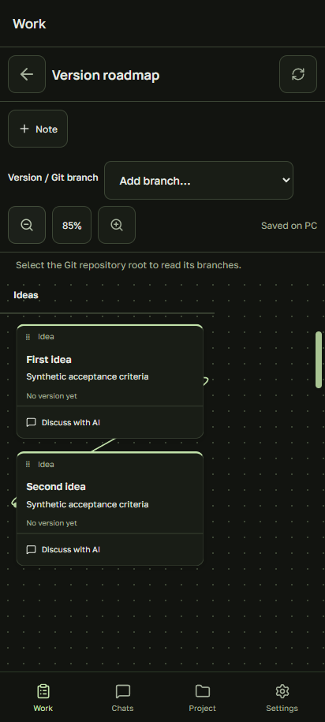

# Рабочие области и доски

Область создаёт и хранит хост — ПК с запущенным Pocket Code. Она объединяет выбранные папки проектов, их доски и чаты. Claude, Codex и Copilot — исполнители внутри области.

## Начало работы

1. Откройте **В работе → Рабочая область**. Укажите название, пароль от 10 символов и папки проектов.
2. Нажмите **Доска проекта** и выберите одну из папок.
3. Создавайте заметки с описанием, критериями готовности, статусом, исполнителем и зависимостями. Заметки перемещаются за верхнюю ручку; доску можно уменьшить до 25%.
4. Добавляйте версии из названий веток Git. Читаются локальные и уже известные удалённые ветки; приложение не делает fetch или checkout. Папка доски должна быть корнем нужного репозитория.
5. **Обсудить с AI** открывает подготовленный черновик. После отправки чат связывается с заметкой. На ПК используется тот же полноценный чат, что и на телефоне.

## Вход и роли

Рядом с QR в разделе **Подключение** выбирается роль приглашённого пользователя. Начальное значение для тестов — **Host**. Оно даёт управление областями и запуск AI на хосте.

Для наблюдателя, разработчика, ревьюера или QA нужно также выбрать область. При смене параметров приглашения QR заменяется: старый больше не подключает новые устройства. Уже подключённым участникам роль автоматически не меняется.

Другой способ — **Войти в рабочую область** на экране подключения: адрес хоста, название области, имя участника и пароль. Такой вход сначала даёт роль наблюдателя. Хост назначает роль и отзывает доступ в **В работе → Участники и роли**. Повторный вход по паролю создаёт новую сессию участника.

Наблюдатель читает доску и чаты своей области. Разработчик, ревьюер и QA также могут редактировать заметки и зависимости. **Запуск AI пока доступен только Host**: для участников ещё нужна изоляция процессов на ПК. Имя участника — подпись сессии, а не подтверждённая корпоративная учётная запись.

Пароли и токены участников хранятся на хосте в виде хешей. Сервер проверяет доступ к области, чатам и файлам. Смена пароля меняет будущие входы; существующие сессии отзываются отдельно. Сам ПК должен быть включён и доступен по указанному адресу.

## Что реализовано сейчас

Это первый этап визуального процесса. Состояние досок сохраняется на ПК; конфликт правок с двух устройств сообщается явно. Циклические и отсутствующие зависимости отклоняются. Прямой список задач Jira в разделе «В работе» отключён, код интеграции сохранён отдельно.

Автоматическое достраивание доски AI, выбор людей, обязательные этапы утверждения и доставка результата в target ещё не реализованы. Статусы заметок меняются вручную; приложение не создаёт PR и не делает merge по отметке «Готово».

[Подробная документация на английском](WORKSPACES.md) · [Руководство пользователя](USER_GUIDE.ru.md)
